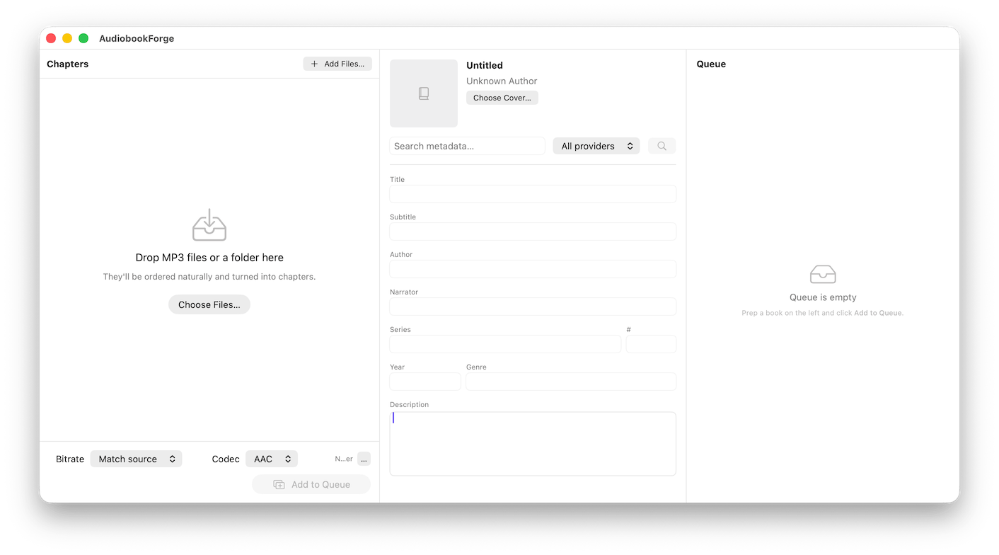

<div align="center">

# AudiobookForge

**A modern macOS app that combines MP3 files into a single chaptered `.m4b`
audiobook — with real metadata lookup, embedded cover art, and a background
encode queue.**

[](https://github.com/bensquire/AudiobookForge/actions/workflows/build.yml)
[](https://github.com/bensquire/AudiobookForge/actions/workflows/release.yml)
[](https://github.com/bensquire/AudiobookForge/releases/latest)
[](https://github.com/bensquire/AudiobookForge/releases)
[](https://www.apple.com/macos/)
[](https://swift.org)
[](LICENSE)

[**Download latest →**](https://github.com/bensquire/AudiobookForge/releases/latest) ·
[Releases](https://github.com/bensquire/AudiobookForge/releases) ·
[Releasing docs](RELEASING.md)

<br/>



</div>

Think Audiobook Builder, but with one-shot drag-folder UX, real metadata
lookup from Audnexus / iTunes, and a native SwiftUI interface.


## Quick start

```bash
./scripts/bootstrap.sh        # installs xcodegen, fetches ffmpeg, generates xcodeproj
./scripts/build.sh debug      # builds a debug .app at build/Build/Products/Debug/
open build/Build/Products/Debug/AudiobookForge.app
```

Or open `AudiobookForge.xcodeproj` in Xcode after running `xcodegen generate`.

## Project layout

```
project.yml                    # XcodeGen config (the source of truth)
AudiobookForge.xcodeproj/      # generated, gitignored
AudiobookForge/
├── App.swift                  # @main + Scene
├── ContentView.swift          # top-level HSplitView
├── Models/                    # Plain Swift structs / @Observable models
├── Services/                  # FFmpegRunner, AudioProbe, MetadataSearch, EncodeJob
├── Views/                     # SwiftUI views
├── Resources/bin/             # Bundled ffmpeg/ffprobe (gitignored, fetched)
├── Info.plist                 # Generated by XcodeGen from project.yml
└── AudiobookForge.entitlements
scripts/
├── bootstrap.sh               # one-shot dev setup
├── fetch-ffmpeg.sh            # download + lipo universal ffmpeg
└── build.sh                   # xcodebuild wrapper (debug | release | archive)
.github/workflows/build.yml    # CI: unsigned macOS build on every push
```

## How the encode pipeline works

1. **Probe** each source file with `AVFoundation` for duration + ID3 tags
   (`AudioProbe.swift`). Avoids a per-file ffprobe shell-out.
2. **Build a concat list** in ffmpeg's demuxer format and an **`FFMETADATA1`
   chapter file** with per-chapter start/end in ms (`ChapterBuilder.swift`).
3. **Pass 1 — encode**: `ffmpeg -f concat -i list.txt -i ffmetadata.txt
   -map_metadata 1 -map_chapters 1 -c:a aac -b:a … out.m4b`.
4. **Pass 2 — cover art**: a second ffmpeg pass with `-c copy` muxes the cover
   as an attached_pic. Done in two passes because piping cover art through the
   concat demuxer in one command is fragile.
5. Output path is templated (`{author}/{title}/{title}.m4b` by default).

Progress comes from parsing `time=` lines on stderr.

## Metadata lookup

`MetadataSearch.swift` queries two APIs in parallel:

- **Audnexus** (`https://api.audnex.us`) — community Audible aggregator used by
  Audiobookshelf and Plex. Free, no key, returns ASIN, narrators, series,
  description, cover URL.
- **iTunes Search API** — free fallback for non-Audible titles.

Hits are deduplicated by `(title, author)` and shown as clickable rows that
apply to the current project. The selected Audnexus hit is then re-fetched
(`enrich`) for full description and high-res cover.

## Releasing

See **[RELEASING.md](RELEASING.md)** for the full playbook. TL;DR:

```sh
# one-time: add 6 GitHub Secrets (cert, password, team ID, 3x notary creds)
git tag v0.1.0 && git push origin v0.1.0
# → GitHub Actions builds, signs (Developer ID), notarizes, packages a DMG,
#   and attaches it to a new GitHub Release.
```

Dry-run locally without burning a tag:

```sh
brew install xcodegen create-dmg
scripts/release.sh 0.1.0
```

## Improvement Ideas

- [ ] Batch queue: process multiple book folders sequentially
- [ ] Persistable projects (`.audiobookforge` document type)
- [ ] Reorderable chapter list with merge/split
- [ ] Drag chapter boundaries when source files don't map 1:1 to chapters
- [ ] Preset library (per-bitrate-and-codec presets)
- [ ] Audible region selection on metadata search

## License

The AudiobookForge source code is released under the **[MIT License](LICENSE)** —
use it, fork it, ship a closed-source product based on it, do whatever; just
keep the copyright notice and don't sue me if it eats your library.

### Third-party components

Release DMGs ship a bundled `ffmpeg`/`ffprobe` (audio decode + AAC encode +
MP4 mux) which is licensed under the **GPL v2 or later** for the build
configuration used. That obligation is independent of the MIT license on the
source — see [RELEASING.md](RELEASING.md) and each release's notes for the
corresponding upstream source links and the rest of the GPL compliance
boilerplate.
