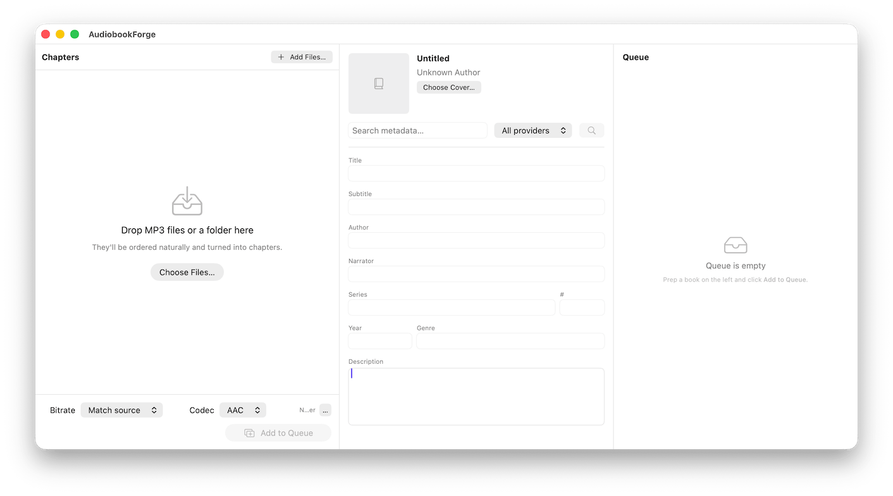

<div align="center">

# AudiobookForge

**A modern macOS app that combines MP3 files into a single chaptered `.m4b`
audiobook — with real metadata lookup, embedded cover art, and a background
encode queue.**

[](https://github.com/bensquire/AudiobookForge/actions/workflows/build.yml)
[](https://github.com/bensquire/AudiobookForge/actions/workflows/release.yml)
[](https://github.com/bensquire/AudiobookForge/releases/latest)
[](https://github.com/bensquire/AudiobookForge/releases)
[](https://www.apple.com/macos/)
[](https://swift.org)
[](LICENSE)

[**Download latest →**](https://github.com/bensquire/AudiobookForge/releases/latest) ·
[Releases](https://github.com/bensquire/AudiobookForge/releases) ·
[Releasing docs](RELEASING.md)

<br/>



</div>

Think Audiobook Builder, but with one-shot drag-folder UX, real metadata
lookup from Audnexus / iTunes, and a native SwiftUI interface.


**Requires Apple Silicon** (arm64). Intel Macs are not supported.

## Quick start

```bash
./scripts/bootstrap.sh        # installs deps, builds bundled ffmpeg, generates xcodeproj
./scripts/build.sh debug      # builds a debug .app at build/Build/Products/Debug/
open build/Build/Products/Debug/AudiobookForge.app
```

First run takes ~7-10 min because it compiles ffmpeg + fdk_aac from
source (stripped to ~10 MB, only the codecs/muxers we use). Subsequent
runs short-circuit.

Or open `AudiobookForge.xcodeproj` in Xcode after running `xcodegen generate`.
The app is sandboxed, so building it from Xcode needs a signing team:
`export DEVELOPMENT_TEAM=XXXXXXXXXX` before generating and xcodegen bakes
it into the project (otherwise pick one under Signing & Capabilities each
time the project is regenerated).

## Tests

```bash
./scripts/test.sh                                    # whole suite
./scripts/test.sh -only OutputPathResolverTests      # single class
```

The unit suite covers the pure logic — path resolution, codec parsing,
chapter-file building, encode-job helpers, progress parsing, formatting,
model invariants, queue manager, config-value parsing. The integration
tests (`EncodeJobIntegrationTests`, `FFmpegProgressTests`) additionally
run the real bundled ffmpeg end-to-end (generated sine-wave fixtures →
chaptered `.m4b`, verified via AVFoundation; live progress reporting)
plus cancellation regressions, so `scripts/build-ffmpeg.sh` must have
run first. SwiftUI views and the metadata network calls remain untested.

The test bundle links `ForgeCore` directly and is not hosted in the app,
so `forge` (the CLI) is only compiled by `scripts/build.sh` / CI, not by
`scripts/test.sh`.

## Lint & format

```bash
./scripts/install-lint-tools.sh   # pinned SwiftFormat + SwiftLint into build/tools (what CI uses)
./scripts/format.sh               # auto-fix what SwiftFormat / SwiftLint can
./scripts/lint.sh                 # check-only; CI runs exactly this and fails on diff
```

Both scripts cover every Swift target (`AudiobookForge`, `ForgeCore`,
`ForgeCLI`, tests) and prefer the pinned tools in `build/tools/bin` when
present, falling back to whatever is on `PATH`.

Config lives in `.swiftformat` and `.swiftlint.yml`. SwiftFormat handles
whitespace, line wrapping, redundant `self`, trailing-comma policy, etc.
SwiftLint enforces a curated subset (we disable the rules that fight
idiomatic patterns — short loop vars, deliberate trailing commas, modern
one-liner braces — and opt into the high-signal ones like
`first_where`, `redundant_nil_coalescing`, `prefer_self_in_static_references`).

## Project layout

```
project.yml                    # XcodeGen config (the source of truth)
AudiobookForge.xcodeproj/      # generated, gitignored
ForgeCore/                     # Headless framework shared by the app and the CLI (no AppKit/SwiftUI)
├── Models/                    # Chapter, BookMetadata, EncodeSettings, AudiobookProject, QueueItem
└── Services/                  # FFmpegRunner, AudioProbe, EncodeJob, QueueManager, MetadataSearch,
                               # LibraryScanner, ChapterBuilder, SettingsStore, SecurityScope, …
AudiobookForge/                # The macOS app
├── App.swift                  # @main + Scene; AppDelegate owns the queue's lifecycle
├── ContentView.swift          # top-level HSplitView
├── Views/                     # SwiftUI views
├── Resources/bin/             # Bundled ffmpeg (gitignored, built from source)
├── Info.plist                 # Generated by XcodeGen from project.yml
└── AudiobookForge.entitlements
ForgeCLI/                      # `forge` batch-pipeline CLI (scan today; plan/run later)
AudiobookForgeTests/           # XCTest bundle for ForgeCore (unit + ffmpeg integration)
scripts/
├── bootstrap.sh               # one-shot dev setup
├── build-ffmpeg.sh            # build the bundled ffmpeg + libfdk_aac
├── build.sh                   # xcodebuild wrapper (debug | release | archive)
├── test.sh                    # run the test suite (whole, or -only <Class>)
├── format.sh / lint.sh        # SwiftFormat + SwiftLint (write / check-only)
├── install-lint-tools.sh      # pinned lint tool binaries into build/tools
├── release.sh                 # local signed release dry-run
├── notarize.sh / make-dmg.sh  # notary submission + DMG packaging
└── ExportOptions.plist        # developer-id export options (TEAM_ID templated)
.github/workflows/
├── build.yml                  # CI: lint, unsigned build, CLI build, tests on every push
└── release.yml                # tagged releases: sign, notarize, DMG, GitHub Release
```

## The `forge` CLI

`ForgeCLI/` builds a `forge` tool on top of the same `ForgeCore` the app
uses, for batch work over a whole library. Today it has one subcommand:

```sh
# ~/.forge/forge.yml
libraryRoots:
  - /Volumes/data/Audiobooks       # scanned recursively
outputRoot: /Volumes/data/forged   # {author}/{title}/{title}.m4b under here
bitrate: source                    # or 64k, 96k, 128k, …
gain: off                          # off, +3 … +12, or auto (auto-normalize)

forge scan            # classify every book: done / needs-forge / needs-review
forge scan --json     # same, as JSON on stdout
forge scan --no-probe # skip ffmpeg chapter probing (fast; mp4 books read as needs-review)
```

Results are written to `~/.forge/manifest.json` (override with
`stateDir:`). A bare tool has no app bundle to find ffmpeg in, so point
it at one:

```sh
FORGE_FFMPEG_DIR=AudiobookForge/Resources/bin forge scan
```

Without it, `scan` refuses to run rather than silently misclassifying
chaptered books (use `--no-probe` if you really don't want probing).
Config values are validated at load time; a bad `gain:` or `bitrate:`
fails immediately with the accepted spellings.

## How the encode pipeline works

Each queued book takes one of two paths through `EncodeJob.runInner`,
depending on whether the sources can be remuxed losslessly:

**Remux path** — when every source file is already AAC with a uniform
sample rate + channel layout *and* the user picked "Match source"
bitrate. A single `ffmpeg` invocation reads the chapters via the concat
demuxer, picks up an `FFMETADATA1` chapter file and an optional cover
image as extra inputs, and writes the final `.m4b` with `-c:a copy` (no
re-encoding). Seconds for a 25-hour book.

**Re-encode path** — everything else. Two phases:

1. **Phase 1 (parallel)** — each chapter source is encoded independently
   into an intermediate `.m4a` via `libfdk_aac`, with codec parameters
   pinned from chapter 0 (sample rate, channels, profile) so the
   intermediates concatenate losslessly. Up to `min(chapters,
   activeProcessorCount, 12)` ffmpeg children run in parallel via
   `withThrowingTaskGroup` + a `ConcurrencyLimiter` actor.
2. **Phase 2 (concat + cover)** — one final `ffmpeg` with the concat
   demuxer over the intermediates, the FFMETADATA1 chapter file, and
   the optional cover image, all muxed with `-c:a copy`. Near-instant.

Both paths write to `out.m4b.partial` and atomic-rename on success, so
a cancel or crash never leaves a stub `.m4b`. Output filename comes
from the template `{author}/{title}/{title}.m4b` by default; collisions
auto-bump via `OutputPathResolver` to `Title (2).m4b`, `(3)`, etc.

Up-front each source is probed via `AudioProbe.swift`:
`AVFoundation` for duration / tags / codec / sample-rate / channels,
plus a 1-second `ffmpeg -t 1 -f null` call to read the codec context's
bitrate from stderr (more accurate than AVF's container-divided
estimate for MP3 with embedded cover art).

Progress comes from each ffmpeg's `time=` lines on stderr, throttled
to per-percent updates and aggregated across parallel chunks by
`ProgressAggregator`.

## Metadata lookup

`MetadataSearch.swift` queries two APIs in parallel:

- **Audnexus** (`https://api.audnex.us`) — community Audible aggregator used by
  Audiobookshelf and Plex. Free, no key, returns ASIN, narrators, series,
  description, cover URL.
- **iTunes Search API** — free fallback for non-Audible titles.

Hits are deduplicated by `(title, author)` and shown as clickable rows that
apply to the current project. The selected Audnexus hit is then re-fetched
(`enrich`) for full description and high-res cover.

## Releasing

See **[RELEASING.md](RELEASING.md)** for the full playbook. TL;DR:

```sh
# one-time: add 6 GitHub Secrets (cert, password, team ID, 3x notary creds)
git tag v0.1.0 && git push origin v0.1.0
# → GitHub Actions builds, signs (Developer ID), notarizes, packages a DMG,
#   and attaches it to a new GitHub Release.
```

Dry-run locally without burning a tag:

```sh
brew install xcodegen create-dmg pkg-config
scripts/release.sh 0.1.0
```

## Improvement Ideas

- [ ] Persistable projects (`.audiobookforge` document type) — queue
  survives app quit
- [ ] Reorderable chapter list with merge/split
- [ ] Drag chapter boundaries when source files don't map 1:1 to chapters
- [ ] Preset library (saved bitrate + filename-template combos)
- [ ] Audible region selection on metadata search
- [ ] Sparkle auto-updates from GitHub Releases

## License

The AudiobookForge source code is released under the **[MIT License](LICENSE)** —
use it, fork it, ship a closed-source product based on it, do whatever; just
keep the copyright notice and don't sue me if it eats your library.

### Third-party components

Release DMGs ship a bundled `ffmpeg` binary built from source
(`scripts/build-ffmpeg.sh`) with **`libfdk_aac`** statically linked for
AAC encoding. ffmpeg itself is **LGPL** in the configuration we build;
`libfdk_aac` is distributed under the **Fraunhofer FDK AAC Codec Library
license**, which is free for distribution in commercial products. Both
attributions appear in each release's notes alongside the upstream
source links.
